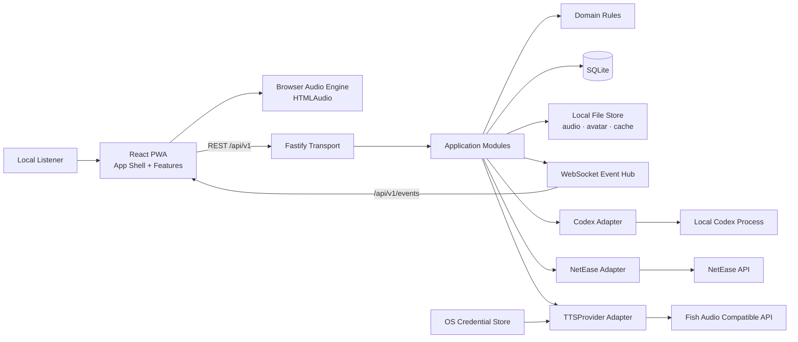
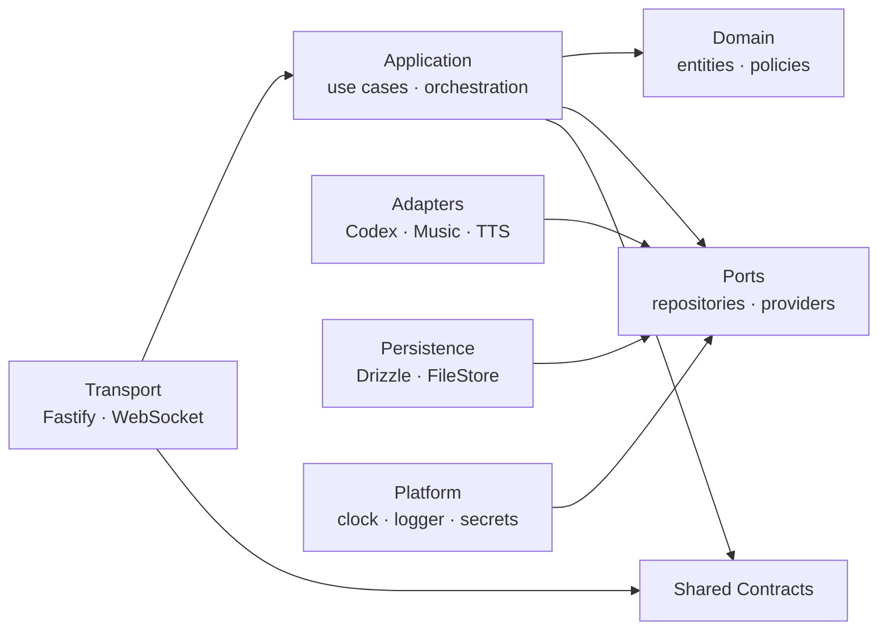
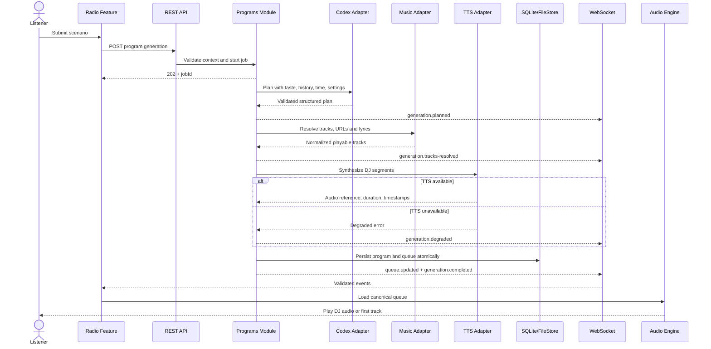
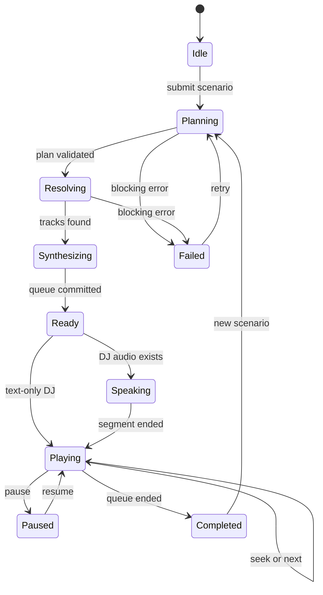
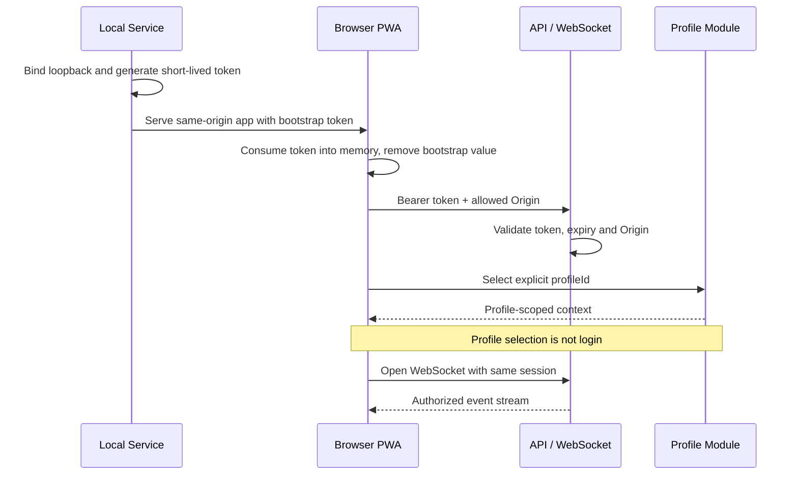
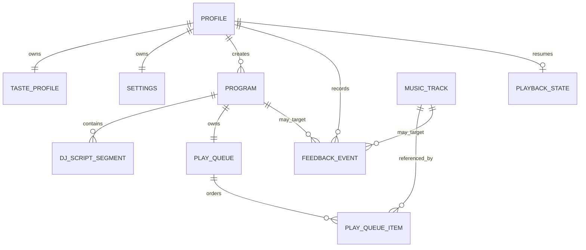
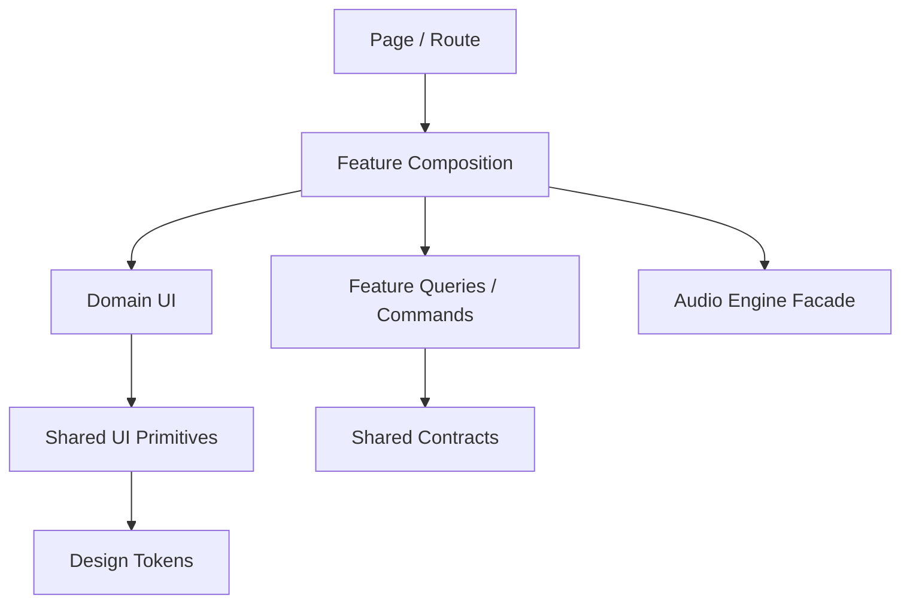
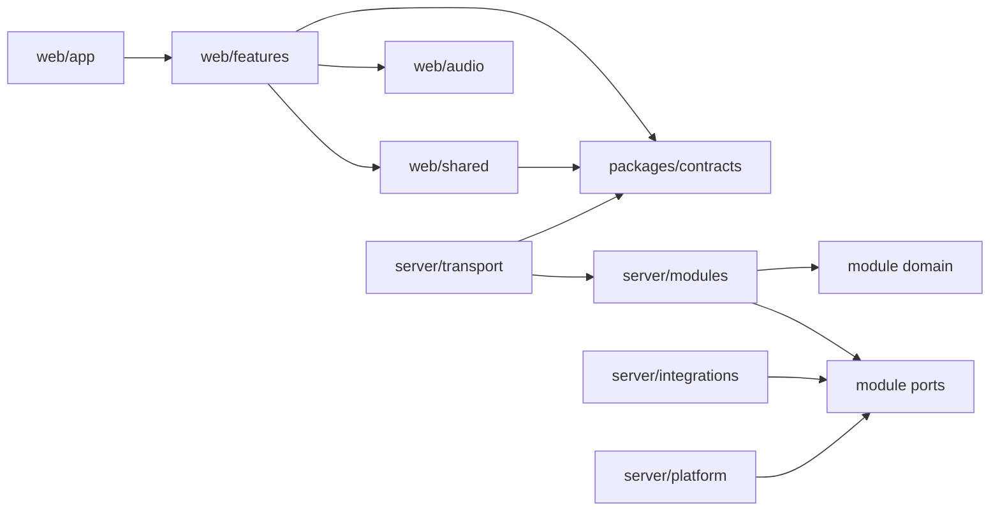

# Koradio System Architecture

> Status: Target Architecture · Documentation-first · Not yet implemented  
> Scope: Local-first Web/PWA MVP  
> Audience: AI Coding Agents, maintainers, system architects  
> Sources: `docs/prd.md`, `docs/user-flow.md`, `design/design.md`

本文档是 Koradio 的系统认知地图，定义稳定的结构、模块所有权、状态事实源、依赖方向与工程决策。
它不承载产品需求、视觉规范、编码规则或实现教程；跨边界实现与本文冲突时，应先更新架构决策。
## 1. System Overview

Koradio 是运行在单台设备上的私人 AI 音乐电台，由浏览器 PWA 与本地 Node.js 服务组成。
系统读取当前档案的品味与历史，通过 Codex 规划节目，经网易云解析歌曲，并可通过 Fish Audio 兼容服务生成 DJ 语音。
### System boundaries

- **Client**：界面、HTMLAudio、实时播放进度和短生命周期交互状态。
- **Local Service**：业务规则、任务编排、持久化、外部服务访问和事件发布。
- **Device**：SQLite、音频缓存、头像与日志只保存在本机。
- **External**：Codex、网易云和 TTS 均为不可信、可失败依赖，只允许 Backend Adapter 访问。
- **Profile**：档案用于数据分区和上下文选择，不是身份认证或安全边界。
| Concern | Authoritative owner | Persistence |
|---|---|---|
| Profile、Taste、Program、Queue、Feedback | Backend + SQLite | Durable |
| 媒体时间、暂停、seek、媒体错误 | Browser Audio Engine | Checkpoint only |
| 生成任务、服务健康状态 | Backend runtime | Snapshot |
| Sheet、draft、筛选等 UI 状态 | Frontend feature | None |
| Theme、DJ language、voice style | Backend Settings | Durable |

MVP 不包含云账号、跨设备同步、支付、社区、多人同步收听、分布式微服务或真实频谱分析。
## 2. High-Level Architecture



- Production 同源托管 PWA、REST、WebSocket 并绑定 loopback；Development 允许 Vite 独立运行并使用 Origin allowlist。
- 请求显式携带 `profileId`；MVP 只有一个 active playback session，多个视图不能同时成为播放事实源。
## 3. Frontend Architecture

Frontend 按 feature 组织；Page 负责组合，不拥有领域规则或 Provider 细节。
| Layer | Responsibility | Allowed dependencies |
|---|---|---|
| App Shell | 启动、路由、Provider、会话、错误边界 | Feature public API、shared |
| Feature | 页面用例、feature UI、query/command 组合 | contracts、shared、audio facade |
| Audio Engine | HTMLAudio、时间线、seek、媒体事件、checkpoint | contracts、Web APIs |
| Server State | 查询缓存、mutation、失效、重连 | API client、contracts |
| UI State | Sheet、draft、折叠、临时选择 | Feature-local state |
| Shared UI | 无领域语义的 primitives 与无障碍行为 | design-tokens |

- TanStack Query 管理服务端状态；Zustand 只管理跨组件、非持久 UI；WebSocket event 校验后才能更新缓存。
- Audio Engine 通过单一 facade 暴露快照；Radio 与 Detail Sheet 共用时间线，页面不得维护多个媒体实例。
## 4. Backend Architecture

Backend 是 TypeScript 模块化单体，模块内采用轻量 Ports and Adapters。


- **Transport**：认证、DTO、状态码和事件连接；**Application**：用例、事务、取消、超时、重试和降级。
- **Domain**：稳定规则，不依赖框架；**Ports**：Application 消费的 repository/provider 接口。
- **Adapters/Persistence**：翻译第三方协议与 I/O，不向上泄露供应商结构。
## 5. Feature Module Structure

| Feature | Owns | Consumes | Produces | Must not own |
|---|---|---|---|---|
| Profiles | 档案 CRUD、profile context | Settings reference | Profile DTO | 登录身份、播放状态 |
| Radio | 场景入口、当前节目组合 | Programs、Playback | Generate command | Provider、持久化 |
| Programs | 生成任务、节目、DJ 段、历史 | Taste、Library、ports | Program、Queue、events | HTMLAudio 状态 |
| Playback | 队列控制、恢复 checkpoint | Program queue | Playback snapshot | 规划、UI Sheet |
| Library | 搜索、导入、候选池 | MusicProvider | NormalizedTrack | 推荐与播放控制 |
| Taste | 标签、避雷、场景规则、摘要 | Feedback | Taste context | Provider response |
| Feedback | 喜欢、不喜欢、跳过、收藏事实 | Playback、Programs | Feedback event | 重写历史事实 |
| Settings | 配置、主题、DJ 偏好、诊断 | SecretStore、health ports | Safe settings | 明文密钥输出 |

- 每个持久实体只有一个写入 owner；其他模块通过 use case/event 协作，Programs 只通过 Ports 调用 Provider。
- Feedback 成功持久化后才更新 Taste projection；Settings 永不输出明文密钥。
## 6. Data Flow

### Program generation


| Failure | Boundary behavior | Result |
|---|---|---|
| Codex error / invalid JSON | End job, retain scenario, expose retry | Blocked |
| Music search exhausted | Do not create empty program | Blocked |
| Data path / transaction error | Roll back creation | Blocked |
| TTS failure | Persist text segment without audio | Continue |
| Lyrics failure | Set unavailable lyric status | Continue |
| Track playback failure | Mark runtime failure, advance queue | Continue if possible |
| Feedback write failure | Reject mutation, revert optimistic UI | Playback continues |

反馈记忆流：`UI intent → feedback_event → Taste projection → cache invalidation → next Codex context`。
历史事实不得因聚合规则变化而被重写；Taste projection 必须可以重建。
## 7. State Management Strategy

| State class | Owner | Synchronization |
|---|---|---|
| Durable domain state | Backend modules | REST reads、commands、events |
| Async job state | Backend runtime | Ordered events + REST snapshot fallback |
| Live media state | Browser Audio Engine | Local subscription + throttled checkpoint |
| Cached remote state | TanStack Query | Event patch or invalidation |
| Cross-component UI | Feature-local Zustand | In-memory only |
| Local UI | React component | Props/events |


- Audio Engine 是 `positionMs`、`paused`、`buffering`、media error 的实时事实源；Backend 只保存低频 checkpoint。
- Event `sequence` 用于去重和丢弃乱序，`correlationId` 隔离任务；重连后先读 snapshot，旧事件不得覆盖新节目。
- 乐观更新只用于可回滚操作；节目、队列、档案切换等待服务端确认。
## 8. API Layer Design

- REST `/api/v1` 承载资源查询、命令、幂等写入、snapshot 和 health check。
- WebSocket `/api/v1/events` 推送生成、队列、反馈确认和服务健康事件。
- Provider 协议不得成为公共 API；所有响应先归一化为 Koradio contracts。
| Capability | Route family | Semantics |
|---|---|---|
| Session | `/api/v1/session` | 本地会话，不代表 profile 登录 |
| Profiles | `/api/v1/profiles` | 档案列表与创建 |
| Profile resources | `/api/v1/profiles/:profileId/*` | 显式 ownership |
| Programs | `.../programs`, `.../program-generations` | 历史与异步生成 |
| Playback | `.../playback`, `.../playback/checkpoints` | snapshot 与 checkpoint |
| Library | `.../library`, `.../music-searches` | 候选池与外部搜索 |
| Taste / Feedback | `.../taste`, `.../feedback-events` | projection 与事实事件 |
| Settings / Health | `.../settings`, `/api/v1/health` | 脱敏配置与诊断 |

- Zod schema 是 wire contract 唯一运行时定义，TypeScript 类型由 schema 推导。
- Event envelope 固定包含 `type`、`version`、`profileId`、`correlationId`、`sequence`、`occurredAt`、`payload`。
- Event families：`generation.*`、`queue.updated`、`playback.snapshot`、`feedback.persisted`、`service.health.changed`。
- 创建命令接受 `Idempotency-Key`；重复请求返回原结果或当前 job。
- Error envelope 包含 `code`、安全 `message`、`retryable`、`correlationId` 和可选字段错误。
- Breaking change 提升 API/event major version；新增可选字段保持向后兼容。
## 9. Authentication Flow

MVP 无云身份认证。Authentication 仅保护本地 HTTP 边界；profile selection 只决定数据上下文。


- 服务只监听 `127.0.0.1` / `::1`，禁止默认监听局域网或公网。
- Token 每次启动生成、短期有效，只驻留内存，不得写入 URL、日志、SQLite、LocalStorage、历史或错误报告。
- REST 与 WebSocket 使用相同校验；Origin 不匹配时拒绝连接。
- Profile-owned 路由始终显式携带 `profileId`，不得由 token 隐式绑定。
- 本地恶意进程不在 MVP 威胁模型内；远程访问必须替换认证边界。
## 10. Database Design Overview

SQLite 保存结构化事实；音频、头像和缓存使用受控文件引用。

| Entity | Owner | Core identity / role |
|---|---|---|
| `profile` | Profiles | `id`；本地数据分区根 |
| `taste_profile` | Taste | `profileId`；可重建品味 projection |
| `settings` | Settings | `profileId`；配置与 secret reference |
| `music_track` | Library | `id` + source identity；归一化曲目 |
| `program` | Programs | `id` + `profileId`；节目快照 |
| `dj_script_segment` | Programs | `id` + `programId`；文本、时序、TTS ref |
| `play_queue` / item | Playback | `programId`、position；规范播放顺序 |
| `playback_state` | Playback | `profileId`；低频可恢复 snapshot |
| `feedback_event` | Feedback | `id` + `profileId`；append-only 事实 |

- 开启 foreign keys、WAL 和版本化 migration；禁止运行时自动重建数据表。
- Program、segments、queue、items 在单个事务中提交，避免半成品节目。
- 播放 URL 是短期资源；历史以 source identity 恢复，FileStore 只返回 data root 内的安全相对引用。
- Profile 删除通过 application use case 清理记录与文件，UI 不执行级联删除。
## 11. Shared Layer Strategy

| Shared area | Allowed | Forbidden |
|---|---|---|
| `packages/contracts` | DTO、command、event、error Zod schemas | ORM、Provider response、React state |
| `packages/design-tokens` | Theme、spacing、typography tokens | 页面布局、feature components |
| Frontend `shared` | API transport、UI primitives、generic hooks | Radio/Taste/Program 规则 |
| Backend `platform` | logger、clock、IDs、SecretStore、FileStore | Feature use cases |

- Shared API 必须比 feature 更稳定且有至少两个消费者；exports 通过公开入口并接受 cycle 检查。
- Wire DTO 与 internal entity 独立；名称相同不代表实现共享。
## 12. Component Architecture



- Page 只组合 feature；Feature Composition 连接 query、command、Audio snapshot 与 domain UI。
- Domain UI 不拥有持久化，Shared primitives 不读 feature store；Detail Sheet 渲染失败不得中断播放。
- 同类组件通过 tokens 和明确 props 复用，禁止页面复制基础组件。
## 13. Dependency Rules


### MUST

- 依赖指向更稳定边界：composition → feature → shared/contract；adapter → port。
- 跨 feature 协作通过公开 application API、contract 或 domain event。
- 外部输入在 transport/adapter 校验；每个 feature 拥有自己的 schema 与 repository。
### MUST NOT

- Frontend 导入 server、Drizzle、Node API 或秘密配置。
- Domain 导入 Fastify、React、Drizzle、WebSocket 或 Provider SDK。
- Feature 查询其他 feature 的表，或调用其内部 repository/store/component。
- Adapter 决定业务降级；event handler 绕过 owning module 修改数据。
- Shared layer 依赖任何 feature。
## 14. Folder Structure Strategy

```text
apps/
├── web/
│   └── src/
│       ├── app/                    # bootstrap, routes, providers
│       ├── features/
│       │   ├── profiles/
│       │   ├── radio/
│       │   ├── programs/
│       │   ├── library/
│       │   ├── taste/
│       │   ├── feedback/
│       │   └── settings/
│       ├── audio/                  # single Audio Engine facade
│       └── shared/                 # transport, primitives, utilities
└── server/
    └── src/
        ├── bootstrap/              # process composition, Fastify startup
        ├── modules/
        │   ├── profiles/
        │   ├── programs/
        │   ├── playback/
        │   ├── library/
        │   ├── taste/
        │   ├── feedback/
        │   └── settings/
        ├── integrations/           # Codex, NetEase, TTS adapters
        └── platform/               # DB, files, secrets, logs, events
packages/
├── contracts/                      # versioned Zod wire schemas
└── design-tokens/                  # shared visual tokens
```

- 文件按共同变化的 feature 聚合，不建全局技术层目录；每个 module 只有一个公开入口。
- Migration 位于 server platform，表定义保留 owning module 标识。
- 新目录只有在 owner、边界和允许依赖明确后创建。
## 15. Scalability Considerations

| Trigger | Evolution path | Preserved boundary |
|---|---|---|
| 生成任务阻塞 API | 移至本地 worker thread/process | ProgramGeneration contract |
| 增加音乐源 | 新 MusicProvider adapter + capability registry | NormalizedTrack |
| 24/7 自动电台 | Scheduler 调用现有 generation use case | Programs ownership |
| 历史或反馈增长 | 归档、索引、增量 Taste projection | Append-only feedback |
| 多设备同步 | Sync service、全局 ID、change log | Profile-scoped resources |
| 远程访问 | Identity boundary、TLS、authorization | Versioned API contracts |

- 仅在独立部署、故障隔离或资源模型出现真实需求时拆分；Provider 可插拔不等于 Domain 插件化。
- 后台任务必须具备 job ID、取消、超时、幂等与可恢复状态。
## 16. Performance Considerations

- Audio Engine 在当前段稳定后预加载下一段，并限制并发与缓存体积。
- 进度在前端高频更新；checkpoint 按间隔、暂停、切歌、关闭事件节流写入。
- WebSocket 不发送逐帧进度，只发布领域变化、任务阶段和低频 snapshot。
- SQLite 使用 WAL、必要索引与短事务；外部请求不得占用数据库事务。
- Program 列表分页；歌词、DJ 文本与历史详情按需加载。
- TTS、歌词和搜索按 provider identity 缓存，并设置容量与清理策略。
- Codex、搜索、TTS 均为异步任务；HTTP 只受理，不等待完整管线。
- Profile 切换取消旧请求并丢弃迟到结果；模拟波形不得持续高 CPU。
## 17. Security Considerations

- Browser、local service、credential store、filesystem 和每个 Provider 都是独立 trust boundary。
- External JSON、歌词、媒体 URL、文件名和 Codex 输出全部视为不可信输入。
- 强制 loopback、Origin allowlist、短期 session；REST 与 WebSocket 同等校验。
- REST、event 和 Provider response 必须通过 Zod runtime validation。
- SecretStore 使用 OS 凭据存储；API 仅返回脱敏状态，日志清除 token、key 和敏感正文。
- FileStore 拒绝路径越界和未允许扩展名；媒体下载限制超时、大小、MIME 与重定向。
- Codex 通过参数数组启动，禁止拼接 shell command；命令路径需验证。
- DB 与缓存使用当前用户最小权限且备份无明文密钥；错误只暴露稳定 code 与安全 message。
## 18. Technical Decisions

| ID | Decision | Reason | Consequence |
|---|---|---|---|
| TD-01 | TypeScript monorepo | 跨端 contract 一致、易于 AI 导航 | 严禁内部类型跨边界泄漏 |
| TD-02 | React + Vite PWA | 本地交付轻量 | OS 能力经 local service |
| TD-03 | Fastify modular monolith | 部署简单、边界可维护 | 单进程故障影响 backend |
| TD-04 | SQLite + Drizzle | 本地事务和迁移可靠 | 云同步需新复制模型 |
| TD-05 | REST + WebSocket | 命令与异步事件分离 | 必须处理重连和乱序 |
| TD-06 | Zod wire contracts | 运行时与静态类型同源 | Schema 必须版本化 |
| TD-07 | Browser owns playback | 最接近真实媒体状态 | Backend 只存 checkpoint |
| TD-08 | Provider ports | 隔离供应商变化 | 增加 adapter mapping |
| TD-09 | OS credential store | 避免本地明文密钥 | Headless 环境需报错 |
| TD-10 | Explicit profile paths | 避免隐式上下文串数据 | 每次调用携带 profileId |
| TD-11 | Append-only feedback | 保留事实、支持重算 | 需要 Taste projection |
| TD-12 | Single active playback | 避免双主状态 | 不支持多标签独立播放 |
## 19. Known Tradeoffs

- 模块化单体易部署，但 process crash 会同时影响全部 backend 能力。
- SQLite 适合单设备事务，不直接支持多写节点。
- Browser Audio 准确，但受页面生命周期与自动播放策略限制。
- WebSocket 适合任务事件，但增加重连、乱序和重复处理。
- 单活播放保持状态清晰，但其他标签页只能只读或申请接管。
- Provider ports 降低耦合，也可能隐藏供应商专属能力。
- OS credential store 更安全，但跨平台与 headless 环境复杂。
- 本地档案首用成本低，但不提供同机用户的机密隔离。
- TTS 文本降级保证连续性，同时削弱语音电台体验。
## 20. Future Architecture Evolution

演进由可观察触发条件驱动，不因预想功能提前增加抽象。
### Stage 1 — Harden local MVP

- 固化 public API、contract check、migration backup，并增加 job snapshot、事件重连和 provider circuit breaker。
- 为单活 Audio Engine 增加标签页主控租约。
### Stage 2 — Expand local automation

- Scheduler 只通过 Programs public use case 生成节目。
- Generation runner 可迁移至 worker process，Fastify 保持命令与事件出口。
- Provider registry 按 capability 选择 adapter，Domain 继续消费归一化模型。
### Stage 3 — Optional sync and remote access

- 增加 change log、全局 ID、冲突策略和加密同步边界。
- 引入 Identity service、TLS、设备授权、refresh token 和 authorization。
- 远程 principal 映射到 profile 后，仍保持 profile-owned API 与 module ownership。
### Architecture change protocol

- 改变事实源、owner、contract、数据库归属或依赖方向时，先修改本文档。
- 新技术选择补充 Technical Decision，记录触发条件、替代方案和代价。
- 图表与代码结构同变更更新；Future 能力在触发前不得污染 MVP Domain 或 Shared Layer。
