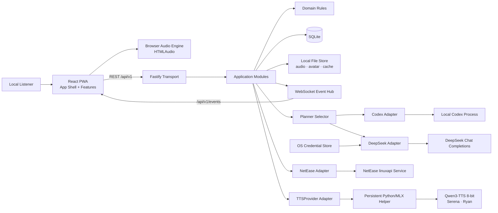
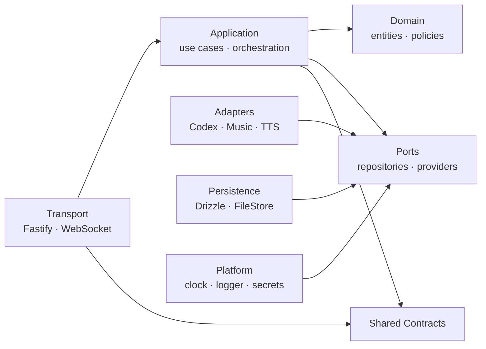
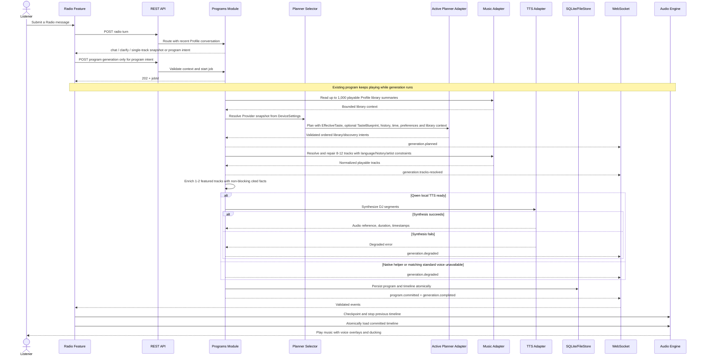
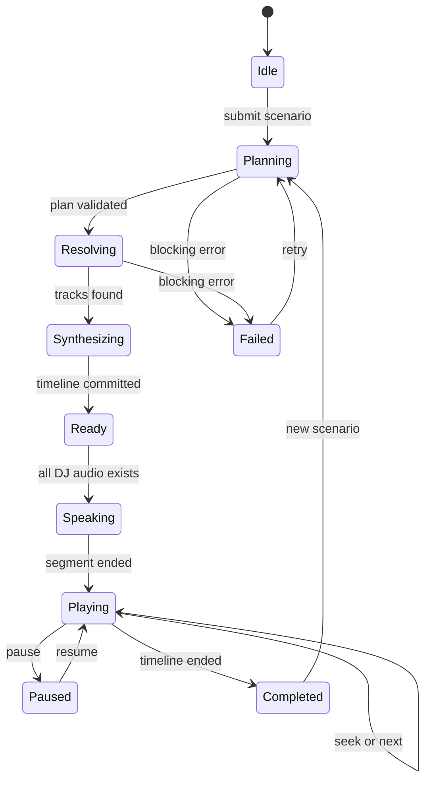
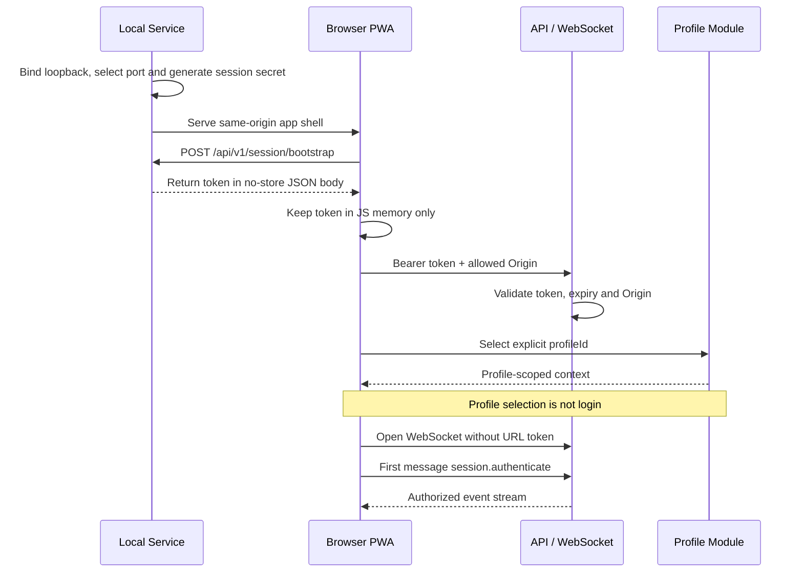
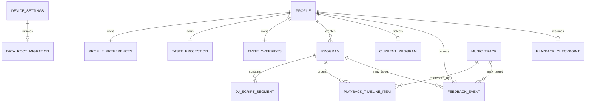
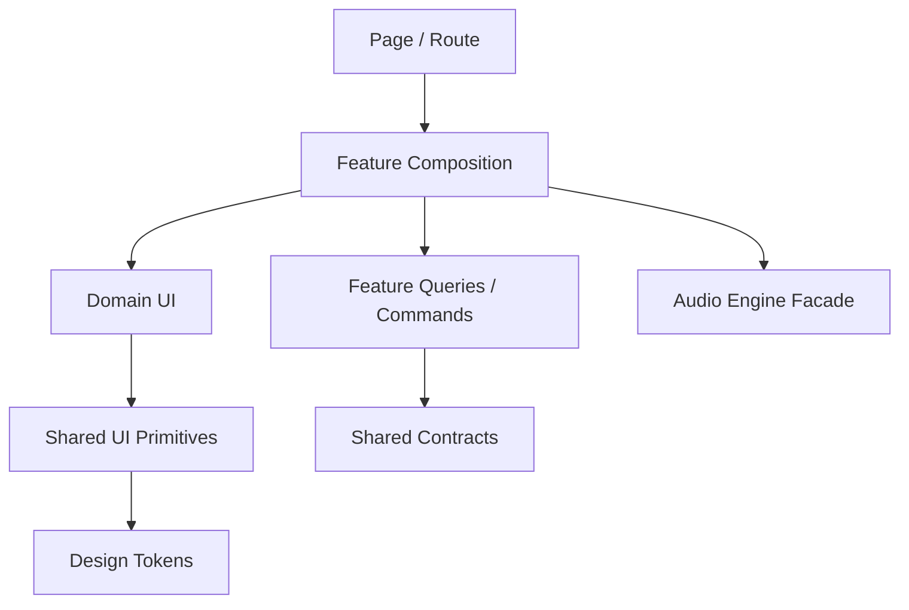
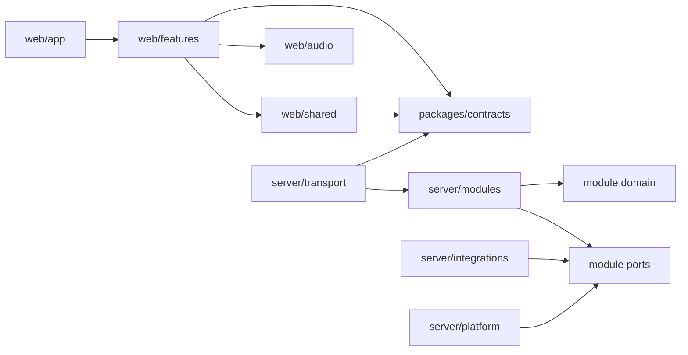

# Koradio System Architecture

> Status: Current architecture · S1–S6 and S7-01/02/06/07/08/09 implemented and accepted · v1.0.0 local stable
> Scope: Local-first Web/PWA MVP  
> Audience: AI Coding Agents, maintainers, system architects  
> Sources: `docs/prd.md`, `docs/user-flow.md`, `design/design.md`

本文档是 Koradio 的系统认知地图，定义稳定的结构、模块所有权、状态事实源、依赖方向与工程决策。
它不承载产品需求、视觉规范、编码规则或实现教程；跨边界实现与本文冲突时，应先更新架构决策。
## 1. System Overview

Koradio 是运行在单台设备上的私人 AI 音乐电台，由 Electron 桌面壳、现有 Web Renderer 与本地 Node.js 服务组成。
系统读取当前档案的 `EffectiveTaste`、可选 `TasteBlueprint` 与历史，通过设备级选择的 Codex 或 DeepSeek Planner 规划节目；蓝图提供软性的特征级选歌、歌曲语言比例、版本选择与串联依据，不改变节目层确定性约束。默认节目从当前 Profile 最多 1,000 首可播放库内曲目组成的完整候选范围中按库内/库外各半规划，奇数时库外多一首；符合硬约束的库内候选不足时由库外补足，显式单一来源请求则严格失败。语言比例是未指定语言时的长期近似目标；原唱与录音室原版优先则由后端统一执行，默认过滤翻唱、Cover、现场、混音、伴奏及加速/降速等变速版本，只有明确点名才可覆盖。系统经本地服务内置的 TypeScript 网易云 `linuxapi` 适配器解析歌曲，并可通过 bundled Python/MLX helper 调用 Qwen3-TTS 8-bit 本地模型生成 DJ 语音。
### System boundaries

- **Client**：界面、HTMLAudio、实时播放进度和短生命周期交互状态。
- **Desktop shell**：Electron 主进程负责单实例、启动前更新、Local Service 生命周期、窗口、菜单栏原生快捷菜单和 Renderer 安全策略；启动只读取已验证 Provider 状态，不重复执行完整节目规划，不拥有播放或业务事实。
- **Local Service**：业务规则、任务编排、持久化、外部服务访问和事件发布。
- **Device**：SQLite、音频缓存、头像与日志只保存在本机。
- **External**：Codex 本地进程、DeepSeek Chat Completions 与网易云均为不可信、可失败依赖，只允许 Backend Adapter 访问；DeepSeek endpoint 固定且 API key 来自 OS Credential Store。
- **Local TTS**：Qwen3-TTS 8-bit 模型与 bundled Python/MLX helper 是本机节目完整性依赖；模型下载、helper 和音频输出均视为可失败 I/O，Local Service 只能通过 TTS Port 调用，全部节目 DJ 音频成功后才允许提交新节目。
- **Profile**：档案用于数据分区和上下文选择，不是身份认证或安全边界。
| Concern | Authoritative owner | Persistence |
|---|---|---|
| Profile、Taste、Program、PlaybackTimeline、Feedback | Backend + SQLite | Durable |
| 媒体时间、暂停、seek、媒体错误 | Browser Audio Engine | Checkpoint only |
| 生成任务 | Backend durable metadata + runtime executor | SQLite Job + ordered events + REST Snapshot |
| 服务健康状态 | Backend runtime | Snapshot |
| Sheet、draft、筛选等 UI 状态 | Frontend feature | None |
| dataRoot、活动 Planner、Codex 命令路径、DeepSeek 模型与隐私确认 | Backend DeviceSettings | Device durable |
| DeepSeek API key | Backend Secret Store | OS Credential Store only |
| NetEase、TTS 能力状态 | Backend runtime | Snapshot |
| Theme、DJ language、voice style | Backend ProfilePreferences | Profile durable |

MVP 不包含云账号、跨设备同步、支付、社区、多人同步收听、分布式微服务或真实频谱分析。
## 2. High-Level Architecture


```mermaid
flowchart LR
    User["Local Listener"] --> Web["React PWA<br/>App Shell + Features"]
    Web --> Audio["Browser Audio Engine<br/>HTMLAudio"]
    Web -->|"REST /api/v1"| API["Fastify Transport"]
    API --> Modules["Application Modules"]
    Modules --> Domain["Domain Rules"]
    Modules --> DB[("SQLite")]
    Modules --> Files["Local File Store<br/>audio · avatar · cache"]
    Modules --> Events["WebSocket Event Hub"]
    Events -->|"/api/v1/events"| Web
    Modules --> Planner["Planner Selector"]
    Modules --> Music["NetEase Adapter"]
    Modules --> TTS["TTSProvider Adapter"]
    Planner --> Codex["Codex Adapter"]
    Planner --> DeepSeek["DeepSeek Adapter"]
    Codex --> CodexExt["Local Codex Process"]
    DeepSeek --> DeepSeekExt["DeepSeek Chat Completions"]
    Music --> MusicExt["NetEase linuxapi Service"]
    TTS --> TTSHelper["Persistent Python/MLX Helper"]
    TTSHelper --> QwenTTS["Qwen3-TTS 8-bit<br/>Serena · Ryan"]
    Secrets["OS Credential Store"] --> DeepSeek
```

- Production 同源托管 PWA、REST、WebSocket 并绑定 loopback；Development 使用 Vite `127.0.0.1:5173` + Local Service `127.0.0.1:49373` 双进程拓扑，并使用精确 Origin allowlist。
- Profile-owned 请求显式携带 `profileId`；MVP 只有一个 active playback session。标签页通过 `BroadcastChannel + localStorage TTL lease` 选出唯一主控，不能同时成为播放事实源。

### Packaging and delivery

- macOS 包装采用 Electron 主进程 + 现有 Web Renderer + bundled Node Local Service + bundled Python/MLX TTS runtime；Electron 主进程只负责进程生命周期、窗口、菜单栏原生快捷菜单和加载同源 origin，不成为播放或业务事实源。菜单栏在启动状态窗口创建后出现，由 Audio Engine 直接订阅播放快照；Renderer 经 context-isolated CommonJS preload bridge 发布受限展示状态、在 ready 后请求已有快照并接收上一首、播放/暂停、下一首命令。主进程不获得 AudioEngine、Provider、Session 或业务数据访问。`app.whenReady()` 后先显示仅包含本地静态内容的启动状态窗口，状态页只通过私有重试通道与主进程交互；启动阶段只等待本地服务和 Renderer，不重复执行完整节目规划。
- Personal Local Preview 只允许 `/Applications/Koradio.app` 作为 Launchpad 桌面入口，并使用同一品牌圆角图标；不安装第二个 PWA shim。Electron 窗口只加载 `http://127.0.0.1:<port>/radio`，不创建普通网页标签。
- 每次正常桌面打开都先从固定 HTTPS 仓库检查 `origin/main`。更新器在应用拥有的缓存目录维护独立源码副本，不修改开发工作树；只有精确远端提交完成 frozen install、production build、ad-hoc strict codesign、Electron 包结构与 smoke 后，才原位替换固定应用路径并重新启动。
- 更新行为是 fail-closed：远端检查、源码同步、构建、验证或替换任一步失败时保留已安装 app、用户数据与回滚副本，但不得启动已知旧版本或打开产品页面；失败期间保留本地启动状态窗口并允许完整重试。旧 app 只允许以非 `.app` 目录保留在非应用位置，避免被 Launch Services、Launchpad 或 Dock 注册为入口。
- 当前只生成 macOS 15+ arm64 app/DMG，捆绑 Node 24.18.0、可重定位 Python 3.12/MLX runtime、production Server 与 built PWA assets；Qwen 模型由用户首次下载到受控数据目录。
- 当前交付渠道仅限项目所有者在受控本机从可信源码构建并个人使用。ad-hoc 签名只用于本地 bundle 结构和生命周期验证，不得作为公开下载或外部分发凭据。
- 公开下载属于后续发布阶段；任何外部分发产物都必须先取得 Developer ID 签名、公证 ticket、Gatekeeper 与独立干净环境验收，不得通过关闭系统安全检查替代。
- 应用二进制、用户数据与 Credential Store 分离；替换或移除 app 不自动删除数据、备份或凭据。

## 3. Frontend Architecture

Frontend 按 feature 组织；Page 负责组合，不拥有领域规则或 Provider 细节。
| Layer | Responsibility | Allowed dependencies |
|---|---|---|
| App Shell | 启动、路由、Provider、会话、错误边界 | Feature public API、shared |
| Feature | 页面用例、feature UI、query/command 组合 | contracts、shared、audio facade |
| Audio Engine | HTMLAudio、时间线、seek、媒体事件、checkpoint | contracts、Web APIs |
| Server State | 查询缓存、mutation、失效、重连 | API client、contracts |
| UI State | Sheet、draft、折叠、临时选择 | Feature-local state |
| Shared UI | 无领域语义的 primitives 与无障碍行为 | design-tokens |

- TanStack Query 管理服务端状态；React feature-local state 管理非持久 UI，Audio Engine facade 管理跨播放组件状态；WebSocket event 校验后才能更新缓存。
- Audio Engine 通过单一 facade 暴露快照；Radio 与 Detail Sheet 共用时间线，页面不得维护多个媒体实例。
- Local Service 完全离线时，只有已打开或被 Service Worker 缓存的 App Shell 可展示只读 Settings；所有配置、Secret、测试和迁移命令禁用，不从浏览器缓存恢复敏感值。
## 4. Backend Architecture

Backend 是 TypeScript 模块化单体，模块内采用轻量 Ports and Adapters。

```mermaid
flowchart LR
    Transport["Transport<br/>Fastify · WebSocket"] --> Application["Application<br/>use cases · orchestration"]
    Application --> Domain["Domain<br/>entities · policies"]
    Application --> Ports["Ports<br/>repositories · providers"]
    Adapters["Adapters<br/>Codex · Music · TTS"] --> Ports
    Persistence["Persistence<br/>Drizzle · FileStore"] --> Ports
    Platform["Platform<br/>clock · logger · secrets"] --> Ports
    Transport --> Contracts["Shared Contracts"]
    Application --> Contracts
```

- **Transport**：认证、DTO、状态码和事件连接；**Application**：用例、事务、取消、超时、重试和降级。
- **Domain**：稳定规则，不依赖框架；**Ports**：Application 消费的 repository/provider 接口。
- **Adapters/Persistence**：翻译第三方协议与 I/O，不向上泄露供应商结构。
- 节目规划在 Application/Domain 边界由两个共享纯模块收口：`listening-intent` 将 Radio 文本和重试上下文归一为锚点、语言/地区、人声模式、来源、年代、场景、情绪、能量、节奏显著度、注意力等级、风格排除和探索倾向；`track-eligibility` 在库内、搜索、锚点和补选路径执行同一套可播放性、原始发行年代、歌词实质性、语言/地区和纯音乐硬校验。纯音乐路径不使用通用替代版本排除，正式器乐候选只要无实质歌词即可解析。Provider 只能提供候选，不能放宽这些规则；Taste 仅作特征级探索引导。
## 5. Feature Module Structure

| Feature | Owns | Consumes | Produces | Must not own |
|---|---|---|---|---|
| Profiles | 档案 CRUD、profile context、受控 `avatarRef` 与 `djAvatarRef` | ProfilePreferences | Profile DTO | 登录身份、播放状态、任意头像路径/URL |
| Radio | Profile 级对话、意图路由、澄清与单曲推荐、重试场景解析 | Programs、Library/Planner/TTS ports、Playback | Radio turn snapshot、Generate command | Provider 协议、HTMLAudio、Program 持久化 |
| Programs | 生成任务、结构化听歌意图、节目、DJ 段、引用、历史与候选资格校验 | EffectiveTaste、TasteBlueprint、Library application ports、Planner/Music/TTS/Fact ports | Program、PlaybackTimeline、events | HTMLAudio 状态、Library owner 表、Radio 对话 |
| Playback | 时间线规则、低频 checkpoint | Program timeline | Playback snapshot | 实时进度、UI Sheet |
| Library | 搜索、导入、候选池 | MusicProvider | NormalizedTrack | 推荐与播放控制 |
| Taste | Profile 级蓝图、自动 projection、人工 overrides、EffectiveTaste | Feedback | Taste context | Provider response、覆盖人工规则 |
| Feedback | 显式喜欢/撤销、不喜欢/撤销、节目收藏/撤销、跳过事实 | Playback、Programs | Append-only FeedbackEvent | 重写历史事实 |
| DeviceSettings | dataRoot、活动 Planner、Codex 命令、DeepSeek 模型/隐私确认、迁移命令、Qwen 模型安装命令 | health ports、Secret Store Port | Safe device settings、credential status、migration/model job | Profile 偏好、NetEase/TTS 地址或密钥、明文密钥输出 |
| ProfilePreferences | 主题、DJ 语言、声音风格 | Profiles | Profile preferences | 服务配置、密钥 |

- 每个持久实体只有一个写入 owner；其他模块通过 use case/event 协作，Programs 只通过 Ports 调用 Provider。
- Feedback 成功持久化后才更新 TasteProjection；TasteBlueprint 与 TasteOverrides 独立持久化，人工规则合并时优先。DeviceSettings 不接受或输出任何 Provider API key；DeepSeek key 只由 Secret Store Port 读写。
- Feedback 以 `(profileId, idempotencyKey)` 去重，并在 `BEGIN IMMEDIATE` 短事务中由 SQLite 分配内部 replay order、按稳定追加顺序回放当前 Profile 反馈学习起点之后的事件、写入新的 TasteProjection；重复命令返回原事件且不推进 projection，内部 replay order 不进入公共 DTO。应用蓝图会清空旧 projection 与 overrides，并将学习起点设为当时的最后 replay order；历史 FeedbackEvent、节目与收藏不删除。
- v1 projection 是事实型映射：`track_liked` / removed、`track_disliked` / removed 和 `program_favorited` / removed 分别维护对应目标的最新有效状态；`track_skipped` 只保留事实和版本，不产生负向推断。自动 tags 暂为空，affinity/avoid signal 使用 `track:<targetId>` 或 `program:<targetId>` 稳定标识。
- EffectiveTaste 在读取时合并，不单独持久化。人工列表保序优先，比较时 trim 并忽略大小写；人工 avoid rule 排除同文本自动 tag 或 affinity，自动 avoid signal 在人工规则之后去重并只填充 contract 剩余容量。
## 6. Data Flow

### Program generation


```mermaid
sequenceDiagram
    actor U as Listener
    participant W as Radio Feature
    participant A as REST API
    participant P as Programs Module
    participant S as Planner Selector
    participant C as Active Planner Adapter
    participant M as Music Adapter
    participant T as TTS Adapter
    participant D as SQLite/FileStore
    participant E as WebSocket
    participant X as Audio Engine
    U->>W: Submit a Radio message
    W->>A: POST radio turn
    A->>P: Route with recent Profile conversation
    P-->>W: chat / clarify / single-track snapshot or program intent
    W->>A: POST program generation only for program intent
    A->>P: Validate context and start job
    P-->>W: 202 + jobId
    Note over W,X: Existing program keeps playing while generation runs
    P->>M: Read up to 1,000 playable Profile library summaries
    M-->>P: Bounded library context
    P->>S: Resolve Provider snapshot from DeviceSettings
    S->>C: Plan with EffectiveTaste, optional TasteBlueprint, history, time, preferences and library context
    C-->>P: Validated ordered library/discovery intents
    P-->>E: generation.planned
    P->>M: Resolve and repair 8-12 tracks with language/history/artist constraints
    M-->>P: Normalized playable tracks
    P-->>E: generation.tracks-resolved
    P->>P: Enrich 1-2 featured tracks with non-blocking cited facts
    alt Qwen local TTS ready
        P->>T: Synthesize DJ segments
        alt Synthesis succeeds
            T-->>P: Audio reference, duration, timestamps
        else Synthesis fails
            T-->>P: Degraded error
            P-->>E: generation.degraded
        end
    else Native helper or matching standard voice unavailable
        P-->>E: generation.degraded
    end
    P->>D: Persist program and timeline atomically
    P-->>E: program.committed + generation.completed
    E-->>W: Validated events
    W->>X: Checkpoint and stop previous timeline
    W->>X: Atomically load committed timeline
    X-->>U: Play music with voice overlays and ducking
```
| Failure | Boundary behavior | Result |
|---|---|---|
| Active Planner error / invalid JSON | End job, retain scenario, expose retry; never auto-switch Provider | Blocked |
| Track intent unavailable | Skip invalid/foreign library IDs, duplicates, unplayable audio, non-canonical versions, wrong language/region, instrumental tracks in vocal-only mode and failed discovery intents in order; never randomly fill from another Profile, and do not create an empty program if all intents fail | Blocked |
| Data path / transaction error | Roll back creation | Blocked |
| TTS failure | Fail the new generation before commit | Retain old Program |
| Lyrics failure | Set unavailable lyric status | Continue |
| Track playback failure | Mark runtime failure, advance queue | Continue if possible |
| Feedback write failure | Reject mutation, revert optimistic UI | Playback continues |

阻断失败不得改变正在播放的旧节目。新的完整节目必须为每个可播出的 DJ segment 取得真实音频引用；TTS 不可用时任务失败，不提交半成品节目。

Radio turn 持久化用户消息、路由决策、助手消息和可选单曲或最多 5 首推荐引用；每个 Profile 只保留最近 50 个 turn。只有明确节目、歌单、8～12 首、重新规划或替换当前节目的请求能创建 generation job；“其他、类似、再推荐”等追问固定为推荐，不得被 Provider 或本地兜底升级为节目。Radio context 带入当前节目标题、场景与曲目摘要，使推荐有明确参照；追问“最推荐哪首”只能引用最近一次推荐列表。单曲先由 Radio 依据歌名、主艺人及版本标记取得原唱录音室候选，再通过 Library public API 在 15 秒总预算内顺序预解析最多 3 条同曲同艺人候选；只有预检成功的候选才可成为临时 DJ 点播。Library 对网络、超时、限流等瞬态音频解析失败只重试一次并把成功结果放入有界内存缓存；候选均失败时 turn 只持久化安全说明和恢复入口，不写入曲目引用，也不替代为翻唱、纯音乐或其他歌曲。安全日志仅记录来源、稳定失败原因和尝试次数，绝不记录播放 URL、用户输入或 Provider 原始正文。单曲与多首推荐解析出的歌曲可被 Browser Audio Engine 作为临时 DJ 点播播放，点播快照不写入 Program、播放历史或持久队列；`PLAY NEXT` 在手动和自然切歌路径都优先消费，结束后恢复原节目队列；空节目时手动下一首直接消费该点播。成功入队不改变对话时间线，只有失败写入卡片关联错误。完整节目 Job 只持久化 `profileId`、幂等键、阶段、状态、事件序列和最终 `programId`，活动 Job 可由 REST Snapshot 在 Radio 重新挂载时恢复。完整 Taste 与有界 Library context 在 Program 原子提交前只存在于内存。Settings 的 Provider 切换先执行轻量连接与认证检测；手动“测试连接”和真正节目生成再从当前 Profile 的偏好、`EffectiveTaste`、最近 20 期历史和最多 1,000 首可播放曲目摘要（覆盖个人完整候选库）构造不落库的 8 首节目骨架 context，验证真实结构化输出。该检测不切换 Provider、不写入 Program、历史或日志正文。Programs 不直接读取 Library 表：它通过同一 Library application Port 获取上述当前 Profile 曲目摘要，按活动 Planner 最多 16 个有序原版 intent 解析所有备用候选；目标严格为 8～12 首、默认 8 首，显式语言/地区/人声约束优先，补选后不足即失败并区分库内曲目、语言/地区、人声、原版筛选或音频可播性原因。语言脚本不明或歌词不可验证时，受约束的人声节目拒绝该候选；Taste 的语言比例只在场景未指定范围时作为软排序。已有当前节目时，成功生成的新 Program 与 `program_handoff` 在同一事务提交，旧 `current_program` 保持不变；Audio Engine 只在当前曲自然结束时调用原子 activate 命令，或响应用户的显式立即切换。DeepSeek 首次结构化输出无效或被截断时，仅在同一 Provider 内以精简的合法计划契约重试一次；generation job 启动时快照 Planner 与模型，Settings 切换只影响下一次生成；服务崩溃或重启时，遗留的 `queued` / `running` Job 收敛为 `PROGRAM_GENERATION_INTERRUPTED`。Audio Engine facade 统一拥有 music/voice 双通道，语音开始时在 350ms 内将音乐降至 28%，语音结束或异常时在 650ms 内恢复。

反馈记忆流：`TasteBlueprint 应用 → feedback learning baseline → UI intent → explicit FeedbackEvent → TasteProjection → TasteBlueprint + TasteOverrides → Planner context`。
历史事实不得因聚合规则变化而被重写；TasteProjection 必须可重建，TasteOverrides 不得被重建覆盖。
Feedback target 必须先通过 owner 提供的公开 Port 校验：歌曲目标由 Library 校验，节目目标由 Programs 校验；production composition 使用真实 Programs owner，只有模块测试可注入确定性 Programs target resolver。
## 7. State Management Strategy

| State class | Owner | Synchronization |
|---|---|---|
| Durable domain state | Backend modules | REST reads、commands、events |
| Async job state | Backend durable metadata + runtime executor | Ordered events + REST snapshot fallback |
| Live media state | Browser Audio Engine | Local subscription + throttled checkpoint |
| Cached remote state | TanStack Query | Event patch or invalidation |
| Cross-component UI | React feature-local state + Audio Engine facade | In-memory only |
| Local UI | React component | Props/events |

```mermaid
stateDiagram-v2
    [*] --> Idle
    Idle --> Planning: submit scenario
    Planning --> Resolving: plan validated
    Resolving --> Synthesizing: tracks found
    Synthesizing --> Ready: timeline committed
    Ready --> Speaking: all DJ audio exists
    Speaking --> Playing: segment ended
    Playing --> Paused: pause
    Paused --> Playing: resume
    Playing --> Playing: seek or next
    Playing --> Completed: timeline ended
    Planning --> Failed: blocking error
    Resolving --> Failed: blocking error
    Failed --> Planning: retry
    Completed --> Planning: new scenario
```

- Audio Engine 是 `positionMs`、`paused`、`buffering`、media error 的实时事实源；Backend 只保存低频 checkpoint。
- Event `sequence` 用于去重和丢弃乱序，`correlationId` 隔离任务；重连后先读 snapshot，旧事件不得覆盖新节目。
- 乐观更新只用于可回滚操作；节目、队列、档案切换等待服务端确认。
- Profile 切换先取消旧 generation、丢弃旧 correlation 的迟到事件、保存并停止旧播放，再加载新 Profile。
- 主控标签每 `2s` 续约、lease `5s` 过期；被动标签只读并可申请接管。主动接管前原主控必须保存 checkpoint 并停止播放，命令以 lease epoch 拒绝旧主控迟到事件。
## 8. API Layer Design

- REST `/api/v1` 承载资源查询、命令、幂等写入、snapshot 和 health check。
- WebSocket `/api/v1/events` 推送生成、队列、反馈确认和服务健康事件。
- Provider 协议不得成为公共 API；所有响应先归一化为 Koradio contracts。
| Capability | Route family | Semantics |
|---|---|---|
| Session | `/api/v1/session` | 本地会话，不代表 profile 登录 |
| Profiles | `/api/v1/profiles` | 档案列表与创建 |
| Profile resources | `/api/v1/profiles/:profileId/*` | 显式 ownership |
| Profile avatar upload | `/api/v1/profile-avatars` | 单文件 multipart 上传，只返回 `avatars/` 受控引用 |
| Current profile | `/api/v1/profiles/current` | 读取或切换本机当前 Profile context；选择不是登录 |
| Programs | `GET .../programs`、`GET .../programs/current`、`GET/DELETE .../programs/:programId`、`POST/GET .../program-generations` | 分页历史、显式当前节目、永久删除、异步生成受理与恢复 snapshot |
| Playback | `GET .../playback`、`PUT .../playback/checkpoints` | 最新低频 snapshot 与带 `leaseEpoch` 的 checkpoint |
| Library | `.../library`, `.../music-searches` | 候选池与外部搜索 |
| Taste / Feedback | `.../taste`, `.../feedback-events` | projection 与事实事件 |
| Device settings | `/api/v1/device-settings` | 设备级非敏感配置：活动 Planner、Codex 命令、DeepSeek 模型与隐私确认 |
| DeepSeek credentials | `/api/v1/device-settings/deepseek-credentials` | 只返回配置状态；PUT/DELETE 通过 Secret Store 写入、替换或删除 key |
| Profile preferences | `/api/v1/profiles/:profileId/preferences` | Profile 级主题与 DJ 偏好 |
| Data root migrations | `/api/v1/device-settings/data-root-migrations` | 幂等异步命令，返回 `202 { jobId }` |
| Health | `/api/v1/health` | 运行时脱敏健康快照，不持久化为配置事实 |

- Zod schema 是 wire contract 唯一运行时定义，TypeScript 类型由 schema 推导。
- S2 v1 contract 已在 `packages/contracts/src/` 实装：公共标识使用 UUID，时间使用 ISO 8601 UTC，媒体时长与位置使用毫秒，音量使用 `0-1`。
- Profile-owned request contract 通过 route params 显式携带 `profileId`；创建类 request contract 同时要求规范化后的 `idempotency-key` header，外部 HTTP 名称仍为 `Idempotency-Key`。
- v1 command、DTO、event 与 error schema 拒绝未知字段；文件引用只允许 `avatars/`、`lyrics/`、`media/`、`tts/` 受控命名空间，不接受绝对路径或裸文件名；Track timeline 的 `resolvedAudioRef` 另允许 Music Adapter 已验证的短期 HTTPS URL，持久身份仍是 `trackId` 与 Provider source identity。
- Event envelope 固定包含 `eventId`、`eventType`、`version`、可选 `profileId`、`correlationId`、`sequence`、`occurredAt`、`payload`。
- v1 Event types：`generation.planned`、`generation.tracks-resolved`、`generation.degraded`、`generation.completed`、`program.committed`、`playback.snapshot`、`feedback.persisted`、`service.health.changed`、`data_root_migration.stage_changed`。WebSocket 不发布高频 position progress。
- 创建命令接受 `Idempotency-Key`；重复请求返回原结果或当前 job。
- `POST /api/v1/profile-avatars` 只接受单个头像文件，先校验图片文件签名、MIME、大小与扩展策略，再由 File Store 生成受控 `avatars/` 引用。
- `GET /avatars/:fileName` 仅接受受控 UUID 文件名和 same-origin 请求，按白名单 MIME 返回头像并设置 `nosniff`；不接受任意路径或 URL。
- `PUT /api/v1/profiles/current` 的 body 显式携带 `profileId`；切换成功前依次取消旧 generation、丢弃旧 correlation 的迟到事件、保存旧 checkpoint、停止旧时间线，最后原子更新本机 bootstrap runtime config。
- v1 Profiles 公共 API 提供创建、列表、读取、更新与选择，不提供删除；删除语义必须另行取得产品决策。
- Error envelope 包含 `code`、安全 `message`、`retryable`、`correlationId` 和可选字段错误。
- Breaking change 提升 API/event major version；新增可选字段保持向后兼容。

### Data root bootstrap and migration

- 首次启动由 platform adapter 选择对应 OS 的应用数据目录，并以最小权限创建；公共配置不写死平台绝对路径。
- 迁移命令先验证目标目录为空且可写，再暂停 generation 与 Browser 播放、保存 checkpoint、建立备份、复制并校验，最后以临时文件 + rename 原子切换 bootstrap 指针并重启。
- 任一阶段失败都回滚 bootstrap 指针并恢复旧目录运行；旧目录和备份不自动删除。
- `Idempotency-Key` 与 job 持久状态保证重复请求返回同一任务；事件只包含阶段、稳定错误码和脱敏元数据。

## 9. Authentication Flow

MVP 无云身份认证。Authentication 仅保护本地 HTTP 边界；profile selection 只决定数据上下文。

```mermaid
sequenceDiagram
    participant S as Local Service
    participant B as Browser PWA
    participant A as API / WebSocket
    participant P as Profile Module
    S->>S: Bind loopback, select port and generate session secret
    S->>B: Serve same-origin app shell
    B->>S: POST /api/v1/session/bootstrap
    S-->>B: Return token in no-store JSON body
    B->>B: Keep token in JS memory only
    B->>A: Bearer token + allowed Origin
    A->>A: Validate token, expiry and Origin
    B->>P: Select explicit profileId
    P-->>B: Profile-scoped context
    Note over B,P: Profile selection is not login
    B->>A: Open WebSocket without URL token
    B->>A: First message session.authenticate
    A-->>B: Authorized event stream
```

- 服务只监听 `127.0.0.1` / `::1`，禁止默认监听局域网或公网。
- Development 默认端口为 Vite `5173` 与 Local Service `49373`；Production 首选 `49373`，可在 `49373-49383` 有界范围内 fallback，并只允许所选 origin。
- Token 每次启动生成、短期有效，只驻留内存，不得写入 URL、日志、SQLite、LocalStorage、历史或错误报告。
- Token 只通过 `POST /api/v1/session/bootstrap` 的 `no-store` JSON 响应返回；不得嵌入 HTML、query、fragment、redirect 或 cookie。
- REST 与 WebSocket 使用相同校验；Origin 不匹配时拒绝连接。
- 浏览器 WebSocket 不使用 URL token；握手校验 Origin，首条消息必须完成 session authentication，认证前不得发送领域事件。
- Profile-owned 路由始终显式携带 `profileId`，不得由 token 隐式绑定。
- 本地恶意进程不在 MVP 威胁模型内；远程访问必须替换认证边界。
## 10. Database Design Overview

SQLite 保存结构化事实；音频、头像和缓存使用受控文件引用。

```mermaid
erDiagram
    DEVICE_SETTINGS ||--o| DATA_ROOT_MIGRATION : initiates
    PROFILE ||--|| PROFILE_PREFERENCES : owns
    PROFILE ||--|| TASTE_PROJECTION : owns
    PROFILE ||--|| TASTE_OVERRIDES : owns
    PROFILE ||--o{ PROGRAM : creates
    PROFILE ||--o| CURRENT_PROGRAM : selects
    PROFILE ||--o{ FEEDBACK_EVENT : records
    PROFILE ||--o| PLAYBACK_CHECKPOINT : resumes
    PROGRAM ||--o{ DJ_SCRIPT_SEGMENT : contains
    PROGRAM ||--o{ PLAYBACK_TIMELINE_ITEM : orders
    MUSIC_TRACK ||--o{ PLAYBACK_TIMELINE_ITEM : referenced_by
    MUSIC_TRACK ||--o{ FEEDBACK_EVENT : may_target
    PROGRAM ||--o{ FEEDBACK_EVENT : may_target
```
| Entity | Owner | Core identity / role |
|---|---|---|
| `profile` | Profiles | `id`、受控 `avatarRef`；本地数据分区根 |
| `profile_preferences` | ProfilePreferences | `profileId`；主题、DJ language、voice style |
| `taste_blueprint` | Taste | `profileId`；稳定特质、语言比例、版本偏好与反馈学习起点 |
| `taste_projection` | Taste | `profileId`；仅由学习起点之后的反馈事实重建的自动投影 |
| `taste_overrides` | Taste | `profileId`；人工规则，正常重建不得覆盖；仅显式应用蓝图会清空 |
| `device_settings` | DeviceSettings | 单设备；dataRoot、活动 Planner、DeepSeek 模型与隐私确认、Codex 命令路径 |
| `data_root_migration` | DeviceSettings | `jobId` + idempotency key；迁移阶段与回滚状态 |
| `music_track` | Library | `id` + source identity、专辑封面 URL、歌词状态与 `originMode` |
| `playlist_source` | Library | `id` + `profileId` + source identity；导入统计与 `originMode` |
| `program` | Programs | `id` + `profileId`；带 `originMode` 的节目快照 |
| `current_program` | Programs | `profileId`；可空的当前节目指针，空值不得从历史推断 |
| `program_handoff` | Programs | `profileId`；一档已就绪但尚未播放的节目，最多一条并在 activation 后删除 |
| `program_generation_job` | Programs | `jobId` + `profileId` + idempotency key；持久阶段、终态和事件 sequence，不保存场景草稿 |
| `program_track` | Programs | `programId`、position、`trackId`；有序 Library 曲目引用 |
| `dj_script_segment` | Programs | `id` + `programId`；文本、时序、TTS ref |
| `playback_timeline_item` | Playback | `programId`、position、`kind`；带音频 `dj` 或 `track` 判别联合 |
| `playback_checkpoint` | Playback | `profileId`、`leaseEpoch`；每个 Profile 最新的低频可恢复 snapshot |
| `feedback_event` | Feedback | `id` + `profileId`；固定 type 的 append-only 事实 |

- 开启 foreign keys、WAL 和版本化 migration；禁止运行时自动重建数据表。
- Programs 通过 Playback 的公开事务写入 Port，在单个事务中提交 Program、ordered track refs、segments 与 timeline items，避免半成品节目；文字 DJ segment 不生成 timeline item。
- checkpoint 写入校验 Program/timeline ownership、item position、时长和 `leaseEpoch`；低于已保存 epoch 的写入被拒绝，`completed` 只允许在最后一个 item 的精确结束边界，并与 Program 完成状态同事务提交。
- Programs 历史详情只通过 Library 的公开 API 重建曲目元数据，不直接读取 Library owner 表。
- Program 生成成功时在同一事务提交 Program、Job 成功终态，并在没有当前节目时更新 `current_program`；已有当前节目时改写 `program_handoff`。手动 `SWITCH NOW` 和当前曲自然结束都通过同一 activation 事务更新 `current_program` 并删除 handoff。永久删除由 Programs application use case 协调：先暂存独占 TTS，再提交关系清理与指针清空，失败恢复文件，提交后物理清理。
- `program.deleted` 通过统一 event envelope 发布；其他标签页必须停止相同 Program、释放播放所有权并刷新派生视图。
- 播放 URL 是短期资源；历史以 source identity 恢复，FileStore 只返回 data root 内的安全相对引用。
- 头像上传 adapter 只返回 data root 内受控 `avatarRef`，拒绝任意 URL、绝对路径或裸文件名。
- Profile 删除如未来被授权，只能通过 application use case 处理记录与文件，UI 不执行级联删除。
## 11. Shared Layer Strategy

| Shared area | Allowed | Forbidden |
|---|---|---|
| `packages/contracts` | DTO、command、event、error Zod schemas | ORM、Provider response、React state |
| `packages/design-tokens` | Theme、spacing、typography tokens | 页面布局、feature components |
| Frontend `shared` | API transport、UI primitives、generic hooks | Radio/Taste/Program 规则 |
| Backend `platform` | logger、clock、IDs、SecretStore、FileStore | Feature use cases |

- Shared API 必须比 feature 更稳定且有至少两个消费者；exports 通过公开入口并接受 cycle 检查。
- Wire DTO 与 internal entity 独立；名称相同不代表实现共享。
## 12. Component Architecture


```mermaid
flowchart TD
    Page["Page / Route"] --> Composition["Feature Composition"]
    Composition --> DomainUI["Domain UI"]
    DomainUI --> Primitives["Shared UI Primitives"]
    Composition --> Queries["Feature Queries / Commands"]
    Composition --> AudioFacade["Audio Engine Facade"]
    Queries --> Contracts["Shared Contracts"]
    Primitives --> Tokens["Design Tokens"]
```

- Page 只组合 feature；Feature Composition 连接 query、command、Audio snapshot 与 domain UI。
- Domain UI 不拥有持久化，Shared primitives 不读 feature store；Detail Sheet 渲染失败不得中断播放。
- 同类组件通过 tokens 和明确 props 复用，禁止页面复制基础组件。
## 13. Dependency Rules


```mermaid
flowchart LR
    WebApp["web/app"] --> WebFeature["web/features"]
    WebFeature --> WebShared["web/shared"]
    WebFeature --> Audio["web/audio"]
    WebFeature --> Contracts["packages/contracts"]
    WebShared --> Contracts
    Transport["server/transport"] --> Module["server/modules"]
    Module --> Domain["module domain"]
    Module --> Ports["module ports"]
    Integrations["server/integrations"] --> Ports
    Platform["server/platform"] --> Ports
    Transport --> Contracts
```
### MUST

- 依赖指向更稳定边界：composition → feature → shared/contract；adapter → port。
- 跨 feature 协作通过公开 application API、contract 或 domain event。
- 外部输入在 transport/adapter 校验；每个 feature 拥有自己的 schema 与 repository。
### MUST NOT

- Frontend 导入 server、Drizzle、Node API 或秘密配置。
- Domain 导入 Fastify、React、Drizzle、WebSocket 或 Provider SDK。
- Feature 查询其他 feature 的表，或调用其内部 repository/store/component。
- Adapter 决定业务降级；event handler 绕过 owning module 修改数据。
- Shared layer 依赖任何 feature。
## 14. Folder Structure Strategy

```text
apps/
├── web/
│   └── src/
│       ├── app/                    # bootstrap, routes, providers
│       ├── features/
│       │   ├── profiles/
│       │   ├── radio/
│       │   ├── programs/
│       │   ├── library/
│       │   ├── taste/
│       │   ├── feedback/
│       │   ├── device-settings/
│       │   └── profile-preferences/
│       ├── audio/                  # single Audio Engine facade
│       └── shared/                 # transport, primitives, utilities
├── desktop/
│   └── src/                        # Electron main process and shell policy
└── server/
    └── src/
        ├── bootstrap/              # process composition, Fastify startup
        ├── modules/
        │   ├── profiles/
        │   ├── programs/
        │   ├── playback/
        │   ├── library/
        │   ├── taste/
        │   ├── feedback/
        │   ├── device-settings/
        │   └── profile-preferences/
        ├── integrations/           # Codex, DeepSeek, NetEase, TTS adapters
        └── platform/               # DB, files, secrets, logs, events
packages/
├── contracts/                      # versioned Zod wire schemas
└── design-tokens/                  # shared visual tokens
native/
└── macos/
    └── qwen-tts-helper/            # persistent Python/MLX JSONL bridge
packaging/
└── macos/                           # Electron, Node and Python entitlements
scripts/
└── release/                         # local package build and verification
```

- 文件按共同变化的 feature 聚合，不建全局技术层目录；每个 module 只有一个公开入口。
- Migration 位于 server platform，表定义保留 owning module 标识。
- 新目录只有在 owner、边界和允许依赖明确后创建。
## 15. Scalability Considerations

| Trigger | Evolution path | Preserved boundary |
|---|---|---|
| 生成任务阻塞 API | 移至本地 worker thread/process | ProgramGeneration contract |
| 增加音乐源 | 新 MusicProvider adapter + capability registry | NormalizedTrack |
| 24/7 自动电台 | Scheduler 调用现有 generation use case | Programs ownership |
| 历史或反馈增长 | 归档、索引、增量 Taste projection | Append-only feedback |
| 多设备同步 | Sync service、全局 ID、change log | Profile-scoped resources |
| 远程访问 | Identity boundary、TLS、authorization | Versioned API contracts |

- 仅在独立部署、故障隔离或资源模型出现真实需求时拆分；Provider 可插拔不等于 Domain 插件化。
- 后台任务必须具备 job ID、取消、超时、幂等与可恢复状态。
## 16. Performance Considerations

- Audio Engine 在当前段稳定后预加载下一段，并限制并发与缓存体积。
- 进度在前端高频更新；checkpoint 按间隔、暂停、切歌、关闭事件节流写入。
- WebSocket 不发送逐帧进度，只发布领域变化、任务阶段和低频 snapshot。
- SQLite 使用 WAL、必要索引与短事务；外部请求不得占用数据库事务。
- Program 列表分页；歌词、DJ 文本与历史详情按需加载。
- TTS 按标准 voice identifier、OS build 与合成参数缓存，歌词和搜索按 provider identity 缓存，并设置容量与清理策略。
- Codex、搜索、TTS 均为异步任务；HTTP 只受理，不等待完整管线。
- Profile 切换取消旧请求并丢弃迟到结果；Audio Engine 仅在可分析的真实媒体播放时采样 Web Audio 时域数据，暂停和 Reduce Motion 下停止刷新，分析不可用时明确降级。
## 17. Security Considerations

- Browser、local service、credential store、filesystem 和每个 Provider 都是独立 trust boundary。
- External JSON、歌词、媒体 URL、文件名、Codex/DeepSeek 输出和 DeepSeek `reasoning_content` 全部视为不可信输入。
- 强制 loopback、Origin allowlist、短期 session；REST 与 WebSocket 同等校验。
- REST、event 和 Provider response 必须通过 Zod runtime validation。
- SecretStore 使用 OS 凭据存储；API 仅返回 DeepSeek key 的布尔状态，日志清除 token、key、prompt、reasoning 和敏感正文。
- v1 的网易云适配器不接收用户 Cookie、开放平台凭据或可配置上游地址；任何未来登录能力必须经新 ADR 与 SecretStore 安全设计。
- 网易云返回的媒体 URL 必须经协议、域名、DNS/重定向、MIME、Range 和大小校验，Browser 只获得已验证的短期 `resolvedAudioRef`。
- TTS 受控文件只通过同源 `/tts/{controlled-file}` 媒体入口提供给 Browser Audio Engine；请求必须由浏览器标记为 `same-origin`，响应使用 `no-store`、`Cross-Origin-Resource-Policy: same-origin` 与 `nosniff`，跨站、缺失来源或非法文件名均拒绝，不在 URL 传 session token。
- Codex/DeepSeek schema 校验失败不得记录原始正文；只记录稳定错误码、correlation ID、schema 失败摘要和脱敏诊断元数据。
- FileStore 拒绝路径越界和未允许扩展名；媒体下载限制超时、大小、MIME 与重定向。
- Codex 通过参数数组启动，禁止拼接 shell command；命令路径需验证。
- DeepSeek 只使用固定 `https://api.deepseek.com/chat/completions`、Bearer key、JSON Output 与 Thinking Mode；429/500/503 最多一次有界重试，其他认证、余额、配置和 schema 错误不自动 fallback。
- Planner 选择在 generation 开始时快照；Settings 切换或模型变更不得中断运行中的 generation 或修改当前节目。
- Qwen3-TTS 通过固定路径的 bundled Python/MLX helper 调用；参数使用数组，DJ 文本经结构化 stdin 传递而不得进入 argv，stdout 只允许脱敏 JSON 结果。
- 固定 revision 模型由用户明确触发下载，逐文件校验大小与 SHA-256 后原子安装；下载与数据目录迁移互斥，退出时中止并清理应用拥有的 partial。
- Python helper 继承受限环境且不拥有业务秘密；当前 ad-hoc 个人预览对 Electron 主进程、Electron helpers 和 Python 子进程分别使用最小化的 hardened-runtime entitlements，Qwen native extensions 所需的 library-validation 权限不向业务 Renderer 暴露。外部分发前必须以 Developer ID 同 Team 重签全部 Mach-O 并重新评估该权限。
- v1 只枚举并使用当前设备已安装的标准系统语音；显式 voice identifier 每次合成前验证仍在可用列表，未显式指定时按语言优先 compact、再选 ttsbundle、最后选择其他标准语音，同级按 identifier 排序，不请求 Personal Voice 授权。
- TTS helper 输出的 PCM/音频元数据必须校验，目标文件只能由 FileStore 分配；超时或取消时终止 helper 并忽略迟到输出。
- DB 与缓存使用当前用户最小权限且备份无明文密钥；错误只暴露稳定 code 与安全 message。
## 18. Technical Decisions

| ID | Decision | Reason | Consequence |
|---|---|---|---|
| TD-01 | TypeScript monorepo | 跨端 contract 一致、易于 AI 导航 | 严禁内部类型跨边界泄漏 |
| TD-02 | React + Vite PWA | 本地交付轻量 | OS 能力经 local service |
| TD-03 | Fastify modular monolith | 部署简单、边界可维护 | 单进程故障影响 backend |
| TD-04 | SQLite + Drizzle | 本地事务和迁移可靠 | 云同步需新复制模型 |
| TD-05 | REST + WebSocket | 命令与异步事件分离 | 必须处理重连和乱序 |
| TD-06 | Zod wire contracts | 运行时与静态类型同源 | Schema 必须版本化 |
| TD-07 | Browser owns playback | 最接近真实媒体状态 | Backend 只存 checkpoint |
| TD-08 | Provider ports | 隔离供应商变化 | 增加 adapter mapping |
| TD-09 | OS credential store | 避免本地明文密钥 | Headless 环境需报错 |
| TD-10 | Explicit profile paths | 避免隐式上下文串数据 | 每次调用携带 profileId |
| TD-11 | Append-only feedback | 保留事实、支持重算 | 需要 Taste projection |
| TD-12 | Single active playback + TTL lease | 避免双主状态 | 主控每 2 秒续约，5 秒过期；其他标签只读或申请接管 |
| TD-13 | DeviceSettings / ProfilePreferences split | 配置 owner 与 Profile 隔离一致 | 路由、表与迁移任务分属明确 owner |
| TD-14 | Discriminated playback timeline | 不把文字降级伪装成音频 | 只有带 audio ref 的 DJ 段进入时间线 |
| TD-15 | Development dual process, production same origin | 保留 Vite HMR，同时让生产安全边界保持单一 loopback origin | 需要精确 Origin allowlist、端口冲突处理和 WebSocket 首消息认证 |
| TD-16 | Qwen3-TTS 8-bit via bundled Python/MLX helper | 获得更自然的本地语音并保持零 API 调用费 | 仅支持 macOS 15+ arm64，需要约 450 MiB runtime、1.84 GiB 首次模型下载、进程 deadline；新节目要求全部语音成功，失败保留旧节目 |
| TD-17 | Built-in TypeScript NetEase `linuxapi` adapter | Personal Local Preview 不依赖官方 CLI、C# 二进制或 .NET 运行时 | 协议变化与公开发布合规必须在 S3/S7 持续验证 |
| TD-18 | Personal Local Preview 启动前从 `origin/main` 本机构建更新 | 固定唯一桌面入口，同时保证每次打开都先确认源码最新且不公开分发 ad-hoc 产物 | 启动依赖网络和本机构建工具；更新失败时 fail-closed，不提供离线启动旧版 |
| TD-19 | Daily Mix 使用独立持久聚合与通用 PlaybackSource | Daily 是无 DJ/TTS 的固定纯歌单，不能伪装成 Program；两类来源需要各自保存播放进度 | 增加 Daily 生成、曲目、checkpoint 与来源会话；保留现有 Program owner 和 public contract |

### Daily Mix generation and playback

- `DailyMix` owner 持有 `(profileId, localDate)` 幂等生成、候选编排、20 首原子提交、七日自然日期保留和 Daily checkpoint。Programs 只在历史页读取 Daily 的 public list/detail port，不拥有或删除 Daily 数据。
- Daily 规划一次生成带储备的库内与探索候选，Backend 以最多 6 路并发搜索并通过 Library public port 执行真实 `resolveAudio` 预检；Provider 只提供候选，不能绕过来源、避重、艺人或可播放性规则。候选不足时最多一次定向补足，任务整体上限 120 秒；生成始终在后台执行，不锁住 Radio、已有播放或 Program 规划。
- Daily 与 Program generation 使用独立活动任务；Profile 激活先提交 Daily，但二者不建立完成依赖。外部调用发生在事务外，只有最终 20 首与任务成功状态在短事务中原子提交。
- Browser Audio Engine 内部使用 `ProgramSource | DailyMixSource` 判别式播放来源。现有 `loadProgram` 行为保持不变，Daily 按播放时重新解析的音频引用构建运行时队列。
- 每个 Profile 的来源会话保存最近 Program、最近 Daily 和当前来源；两类 checkpoint 独立持久化。临时 `PLAY NEXT` 只存在于 Audio Engine 单槽位上下文，不进入任何持久来源或历史。
- Daily 的自然日期由本地服务按设备当前本地时区计算并落为 `YYYY-MM-DD`。记录保留窗口为今天至前 6 天；清理只移除 Daily 行和关联，不删除共享 MusicTrack、LibraryItem、Feedback 或来源不明文件。
## 19. Known Tradeoffs

- 模块化单体易部署，但 process crash 会同时影响全部 backend 能力。
- SQLite 适合单设备事务，不直接支持多写节点。
- Browser Audio 准确，但受页面生命周期与自动播放策略限制。
- WebSocket 适合任务事件，但增加重连、乱序和重复处理。
- 单活播放保持状态清晰，但其他标签页只能只读或申请接管。
- Provider ports 降低耦合，也可能隐藏供应商专属能力。
- OS credential store 更安全，但跨平台与 headless 环境复杂。
- 本地档案首用成本低，但不提供同机用户的机密隔离。
- 新节目 TTS 失败时保留旧节目，避免提交缺少语音的半成品；历史缺失音频仍可显示已有文字。
## 20. Future Architecture Evolution

演进由可观察触发条件驱动，不因预想功能提前增加抽象。
### Stage 1 — Harden local MVP

- 固化 public API、contract check、migration backup，并增加 job snapshot、事件重连和 provider circuit breaker。
### Stage 2 — Expand local automation

- Scheduler 只通过 Programs public use case 生成节目。
- Generation runner 可迁移至 worker process，Fastify 保持命令与事件出口。
- Provider registry 按 capability 选择 adapter，Domain 继续消费归一化模型。
### Stage 3 — Optional sync and remote access

- 增加 change log、全局 ID、冲突策略和加密同步边界。
- 引入 Identity service、TLS、设备授权、refresh token 和 authorization。
- 远程 principal 映射到 profile 后，仍保持 profile-owned API 与 module ownership。
### Architecture change protocol

- 改变事实源、owner、contract、数据库归属或依赖方向时，先修改本文档。
- 新技术选择补充 Technical Decision，记录触发条件、替代方案和代价。
- 图表与代码结构同变更更新；Future 能力在触发前不得污染 MVP Domain 或 Shared Layer。
