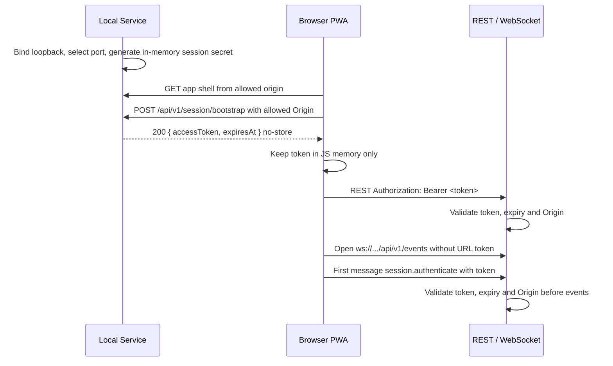

# ADR 0002：运行拓扑、端口与本地会话

> 状态：已接受
> 日期：2026-07-15
> 决策人：项目所有者
> Task：S0-04
> 取代：无
> 被取代：无

## 1. 背景

Koradio 当前仍处于 Documentation-first 阶段，没有 `package.json`、产品源码、启动脚本、已实装端口或可运行服务。目标架构已经确定 React + Vite PWA、Fastify Local Service、REST `/api/v1`、WebSocket `/api/v1/events`、loopback 绑定、短期内存 session 与 Origin 校验；本任务需要关闭 development / production 拓扑、端口、启动关系、session bootstrap 与端口冲突处理。

S1 脚手架需要稳定的 `dev` 合同，S2 session/Origin 安全实现需要明确 token 传递方式，S0-05 macOS 包装 PoC 也需要知道生产入口和端口选择边界。本 ADR 只裁决运行拓扑和安全边界，不声明这些配置已经实现。

## 2. 决策范围

### 包含

- Development 中 Web dev server、Local Service、REST 与 WebSocket 的进程关系。
- Production 中 PWA 静态资源、REST 与 WebSocket 的同源托管关系。
- 默认绑定地址、端口分配原则和端口冲突处理。
- Session bootstrap、REST 与 WebSocket 的 token 使用方式。
- Origin allowlist 的来源、默认值和 override 边界。
- Local Service 完全离线时，已打开或缓存 PWA 的允许行为。

### 不包含

- 实际 `package.json` scripts、Vite/Fastify 配置、CI workflow 或测试代码；由 S1/S2 创建。
- macOS 桌面壳、一体包或 PWA + Local Service 安装器的最终形态；由 S0-05 裁决。
- Provider SDK、数据库驱动、ORM、Secret Store 具体 adapter 或业务模块实现。
- 云身份、远程访问、TLS、refresh token、设备授权或多用户安全隔离。
- 产品 UI、视觉 token 或页面实现。

## 3. 约束与决策驱动因素

| 因素 | 必须满足的条件 | 证据来源 |
|---|---|---|
| 工程 | S1 的 `dev` 必须有可实现的进程、端口和代理/调用关系；不得提前创建产品代码 | [ADR 0001](0001-toolchain-and-quality.md)、[tasks.md](../project-management/tasks.md) |
| 架构 | Production 同源托管 PWA、REST、WebSocket；Development 可由 Vite 独立运行并使用 Origin allowlist | [architecture.md](../../architecture.md) |
| 安全 | 服务默认只绑定 `127.0.0.1` 或 `::1`；REST 与 WebSocket 使用同一 session 和 Origin 校验；token 不进入 URL、日志、SQLite、LocalStorage、历史或错误报告 | [AI_RULES.md](../../AI_RULES.md) |
| 产品与流程 | Local Service 完全离线时，仅已打开或缓存 PWA 可展示只读 Settings、启动说明、脱敏状态和重试 | [docs/prd.md](../prd.md)、[docs/user-flow.md](../user-flow.md) |
| 发布与包装 | 最终安装包必须自带运行时；S0-05 可比较包装形态，但不得要求改变播放事实源或放宽本地 HTTP 安全边界 | [roadmap.md](../project-management/roadmap.md)、[ADR 0001](0001-toolchain-and-quality.md) |

## 4. 候选方案

### 方案 A：开发与生产均同源单服务

- 做法：Local Service 在所有环境中同时服务 PWA、REST 和 WebSocket；开发时也先构建或预览 Web。
- 收益：Origin 和 token 模型最简单，生产一致性强。
- 代价：开发反馈慢，Vite HMR 和前端调试体验下降；S1 初期需要更多构建胶水。
- 风险：为追求开发便利，后续可能临时打开宽松 CORS 或额外 dev server，反而形成未记录拓扑。
- 验证结果：安全简单但不利于 S1 快速建立最小骨架。

### 方案 B：开发双进程，生产同源单服务

- 做法：Development 使用 Vite Web dev server 与 Fastify Local Service 两个进程；Production 由 Local Service 同源托管构建后的 PWA、REST 和 WebSocket。
- 收益：保留 Vite HMR 和清晰 S1 开发入口，同时让生产安全边界保持同源、loopback、单 HTTP 入口。
- 代价：开发需要精确 Origin allowlist、CORS 预检和 API origin 配置。
- 风险：若 dev override 支持任意 Origin，可能扩大本地攻击面；必须禁止 wildcard 并从配置生成精确 allowlist。
- 验证结果：满足架构现有表述，并能用最小探针验证 token 不进入 URL 或日志。

### 方案 C：生产拆分静态 PWA 与 API 服务

- 做法：Production 中 PWA 由一个静态服务或浏览器缓存入口承载，Local Service 只提供 API/WS，二者跨 Origin 通信。
- 收益：静态资源与 API 部署职责分离，PWA 安装模型直观。
- 代价：生产也需要 CORS/Origin 例外、服务发现和端口协调。
- 风险：包装 PoC、离线缓存和 token bootstrap 都更复杂；更容易把 token 放入 URL、持久配置或用户可见启动参数。
- 验证结果：不符合目标架构的生产同源约束，暂不采用。

## 5. 裁决

采用 **方案 B：开发双进程，生产同源单服务**。

### 5.1 Development 拓扑

```text
Browser PWA
  ├─ http://127.0.0.1:5173/              Vite dev server, Web/HMR only
  └─ http://127.0.0.1:49373/api/v1       Fastify Local Service
       └─ ws://127.0.0.1:49373/api/v1/events
```

- Vite dev server 默认绑定 `127.0.0.1:5173`。
- Local Service 默认绑定 `127.0.0.1:49373`，REST 与 WebSocket 共用同一 Fastify 进程。
- Development 默认 strict port：端口被占用时启动失败并给出可操作诊断，不自动随机漂移。
- 允许通过显式非敏感环境变量覆盖 dev 端口，但启动时必须据此生成精确 Origin allowlist；禁止 `*`、通配子域或任意用户输入直接进入 allowlist。
- 默认 Development allowlist 仅包含 `http://127.0.0.1:5173` 和 API same-origin `http://127.0.0.1:49373`；若显式启用 IPv6 loopback，则加入对应 `http://[::1]:<port>`。
- 默认不允许 `localhost` Origin；S1 应将 Vite host 固定为 `127.0.0.1`，避免 DNS 或主机名差异扩大边界。

### 5.2 Production 拓扑

```text
Browser PWA
  └─ http://127.0.0.1:<selected-port>/
       ├─ built PWA assets
       ├─ REST /api/v1
       └─ WebSocket /api/v1/events
```

- Production 只有 Local Service 一个 HTTP 入口，同源托管 PWA、REST 与 WebSocket。
- Production 首选端口为 `49373`，只绑定 loopback。
- 若首选端口被占用，launcher / bootstrapper 先判断是否为现有 Koradio Local Service；若是，复用该实例并打开其 origin。
- 若端口被未知进程占用，Production 可在 `49373-49383` 有界范围内选择第一个可用端口，并只允许所选 origin。
- 若范围内端口均不可用，启动失败并显示脱敏诊断；不得自动监听 LAN、公网或随机无限范围端口。
- 选定端口可以写入当前进程的 bootstrap 状态或 launcher 进程内存，用于打开浏览器；不得作为安全凭据，也不得包含 session token。

### 5.3 Session bootstrap



- Local Service 每次进程启动生成新的 session secret，旧 token 在重启后全部失效。
- `POST /api/v1/session/bootstrap` 是唯一 token bootstrap 入口；响应必须设置 `Cache-Control: no-store`，不得写 Set-Cookie。
- Token 只返回在 JSON 响应体中，不嵌入 HTML、URL、query、fragment、redirect、日志、SQLite、LocalStorage、SessionStorage、IndexedDB 或错误报告。
- Browser 只在 JS 内存中保存 token。页面 reload 后重新 bootstrap；Local Service 离线时不恢复旧 token。
- REST 使用 `Authorization: Bearer <token>`。
- 浏览器原生 WebSocket 不能设置任意 Authorization header；因此 `/api/v1/events` 握手阶段只校验 Origin，连接建立后首条消息必须是 Zod 校验的 `session.authenticate`，服务端在认证前不得发送领域事件，并在短超时后关闭未认证连接。
- 日志必须脱敏 `Authorization`、bootstrap 响应体、WebSocket auth 消息和任何 session 相关字段。
- Profile 选择仍通过显式 `profileId` 路由或 command 字段表达，不由 token 隐式绑定。

### 5.4 Origin allowlist

- Allowlist 是服务启动时由当前拓扑和显式配置生成的精确集合。
- Origin 比较必须使用规范化后的 `scheme + host + port`，并拒绝缺失、大小写/编码异常或与当前拓扑不匹配的 Origin。
- Production 默认只允许当前 selected app origin。
- Development 默认允许 Vite origin 与 API same-origin；端口 override 时同步生成对应精确 Origin。
- CORS 只允许必要方法、`Authorization`、`Content-Type`、`Idempotency-Key` 和明确的 contract headers；不得允许 credentials cookie 作为 session 机制。

### 5.5 离线 PWA 行为

- Local Service 完全不可达时，只有已打开或 Service Worker 已缓存的 App Shell 可以显示离线异常页和只读 Settings。
- 离线状态不得读取或恢复明文密钥、旧 token、迁移命令、配置保存命令或测试连接命令。
- 未缓存 PWA 不承诺离线可达；launcher 应引导用户启动 Local Service，而不是提供独立浏览器端功能。

## 6. 后果

### 正向后果

- S1 可以实现稳定 `dev`：Vite `5173` + Local Service `49373`。
- Production 与目标架构保持同源，减少 CORS、service worker、WebSocket 和 session 分叉。
- Token 不需要进入 URL 或持久浏览器存储，也不依赖 cookie。
- S0-05 两种 macOS 包装候选都可以复用同一 Local Service 安全边界。

### 负向后果与权衡

- Development 需要显式处理 CORS、Origin allowlist 和 API origin 注入。
- Production 端口有有界 fallback，PWA 安装或缓存体验必须由 S0-05/S7 launcher 进一步验证。
- WebSocket 首条认证消息比 query token 或 cookie 多一步状态机，S2 必须测试未认证连接超时、乱序消息和日志脱敏。
- 默认不支持 `localhost` Origin，开发脚本和文档必须明确使用 `127.0.0.1`。

### 保持不变

- Browser Audio Engine 仍是实时播放状态事实源，Backend 只保存低频 checkpoint。
- REST `/api/v1` 与 WebSocket `/api/v1/events` 的 contract 和事件 envelope 仍由后续 S2 定义。
- Local Service 仍默认只绑定 loopback，不引入云账号、远程访问、TLS 或 refresh token。
- DeviceSettings、ProfilePreferences、Secret Store、SQLite 与 Provider adapters 的 owner 不变。

## 7. 实施与验证

| 项目 | 结果或计划 | 证据 |
|---|---|---|
| 实施路径 | S1-01/S1-03 创建 `dev` 入口、端口配置和同源 production static serving；S2-04 实现 session middleware、Origin 校验和 WebSocket auth 状态机 | 本 ADR、[tasks.md](../project-management/tasks.md) |
| 自动检查 | S0-04 使用本地最小 Node 探针验证通过：loopback server 通过 JSON bootstrap 返回 token；请求 URL、HTML、Set-Cookie、日志和浏览器持久存储模拟均不包含 token | `node -e` 探针输出 `{"ok":true,"boundHost":"127.0.0.1","checked":["json-bootstrap","no-url-token","no-html-token","no-set-cookie","no-persistent-store-token","no-log-token"]}` |
| 人工/外部验证 | 对照 `architecture.md`、`AI_RULES.md`、`docs/prd.md` 与 `docs/user-flow.md` 复核 token、Origin、离线 PWA 和端口冲突规则 | 本 PR 审阅 |
| 回滚或替代路径 | 若 S0-05 证明包装候选必须改变端口、Origin 或 token 边界，则重新打开 S0-04 或用新 ADR 取代本 ADR | S0-05 阻塞条件 |

## 8. 权威文档同步

| 文档 | 是否需要修改 | 原因或结果 |
|---|---|---|
| `docs/prd.md` | 否 | 产品行为未变化；离线 PWA 与只读 Settings 沿用既有规则 |
| `docs/user-flow.md` | 否 | 用户流程未变化；本 ADR 只细化运行拓扑 |
| `architecture.md` | 是 | 将已决策的端口、bootstrap 和 WebSocket 认证方式同步为目标架构细节 |
| `design/design.md` | 否 | UI、token、动效和无障碍未变化 |
| `AI_RULES.md` | 是 | 将 S0-04 关闭的端口、URL token 禁止和 WS auth 约束纳入工程硬约束 |
| `README.md` / `context.md` | 是 | 将未决项从“尚未决定”更新为“ADR 0002 已选定但尚未实装” |

## 9. 后续任务

- S0-05：在两种 macOS 包装 PoC 中验证 launcher、端口 fallback、同源 production 和 Credential Store 边界。
- S1-01：创建 workspace manifest 与根 `dev` script，占位实现本 ADR 的目标合同。
- S1-03：建立 Web、Server、Contracts 与 Tokens 最小骨架，并验证 `/api/v1/health` 与 `/api/v1/events`。
- S2-04：实现短期内存 token、Origin 校验、REST/WS 同 session 和浏览器存储/日志安全测试。
